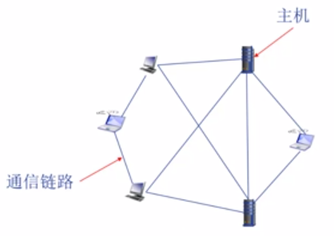
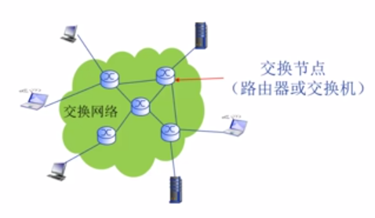
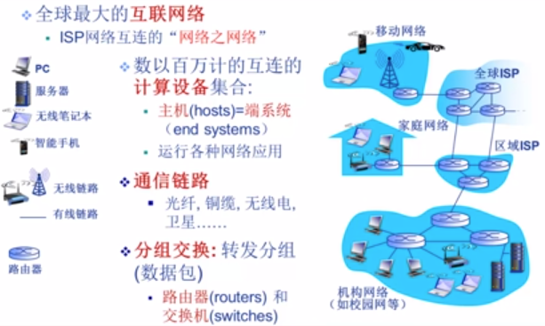
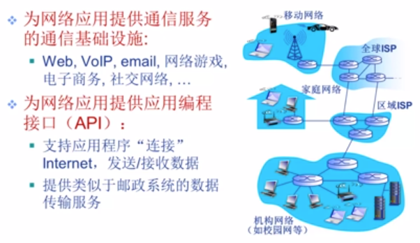
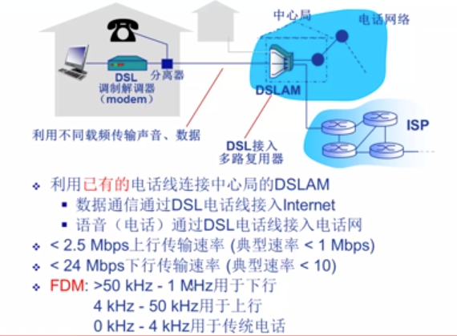
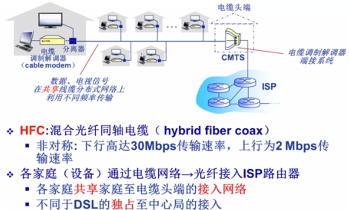
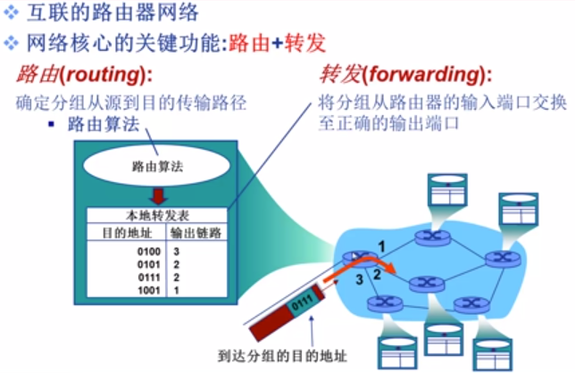
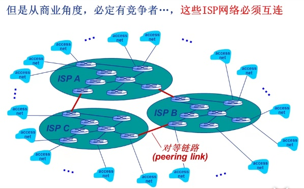
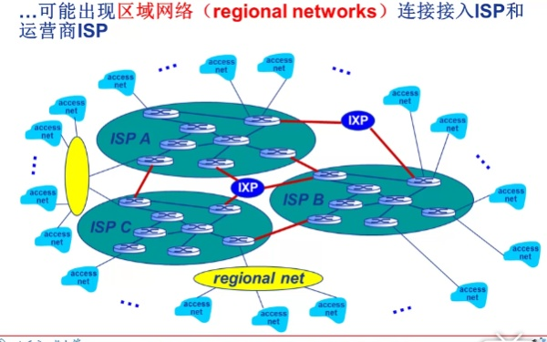
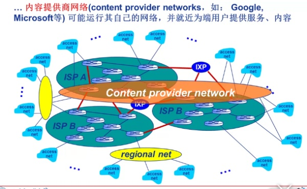

# 计算机网络和因特网

## 1 计算机网络：就是互联的、自治的计算机集合。  
- 自治：无主从关系
- 互联：互联互通（通信链路）
- 通过交换网络互联主机

     

Internet:
组成角度：全球最大的互联网络，由数以百万计的互联的计算设备集合；设备之间通过通信链路链接。

       

服务角度：为网络应用提供通信服务的通信基础设施（Web、VoIP、email、网络游戏等）；为网络应用提供应用编程接口（API）。        

      

协议：  

1. 语法
    - 数据与控制信息的结构或格式
    - 信号电平
2. 语义
    - 需要发出何种控制信息
    - 完成何种动作以及做出何种响应
    - 差错控制
3. 时序
    - 事件顺序
    - 速度匹配

## 2 计算机网络结构

计算机网络结构：
1. 网络边缘
    - 主机
    - 网络应用

2. 接入网络，物理介质
    - 有线、无线通信链路

3. 网络核心（核心网络）
    - 互联的路由器（或分组转发设备）
    - 网络之网络
 

### 2.1  网络边缘

1. 主机（host) /端系统（end system）

因特网是一个世界范围的计算机网络，即它是一个互联了全世界数十亿计算设备的网络，这些计算设备包括传统的桌面PC、Linux工作站及服务器等，也包括    
越来越多的非传统的因特网“物品”，如智能手机、平板电脑、电视、游戏机、手表、家用电器等，所有这些设备都称为主机或端系统。   
主机有时进一步细分为 客户端（client） 和服务器（server）。
客户端： 如桌面PC、移动PC、智能手机等；  
服务器：用于存储和发布Web页面、流视频、中继电子邮件等。

主机：
- 位于网络边缘
- 运行网络应用程序，如Web、email

客户/服务器应用模型：
- 客户发送请求，接收服务器响应
- 如 Web应用，文件传输FTP应用

2. 对等（P2P)应用模型  

- 无（或不仅依赖）专用服务器  
- 通信在对等实体之间进行 
- 如BT、Skype、QQ

### 2.2 接入网络

#### 2.2.1 概念
1 通信链路(communication link)     
端系统通过通信链路和分组交换机连接到一起，通信链路由不同的物理媒体组成，包括如同轴电缆、铜线、光纤和无线电频谱。    

2 分组交换机(packet switch)    
分组交换机从它的一条入通信链路接收到达的分组，从它的一条出通信链路转发分组。常见的有路由器（router) 和链路层交换机（link-layer switch）。     

3 分组（packet）   
端系统之间传递数据时，发送端将数据分段，并为每段加上首部字节，由此形成的信息包称为分组。   

4 传输速率    
链路上数据的传输速度，单位bps（bit/s）    

5 因特网服务提供商（Internet Service Provider ISP）    
互联网服务提供商，即向广大用户综合提供互联网接入业务、信息业务和增值业务的电信运营商。  

6 协议（protocol）    
协议定义了在两个或多个通信实体之间交换的报文的格式和顺序，以及报文发送和/或接收一条报文或其他事件所采取的动作。
计算机网络中主要的协议有TCP/IP 协议。

7 请求评论（Request For Comment RFC）   
IETF（Internet Engineering Task Force，因特网工程任务组）的标准文档称为 RFC。

8 分布式应用程序（distributed application）    

应用程序涉及多个相互交换数据的端系统，称为分布式应用程序。

9 套接字接口（socket interface）    
套接字接口规定了运行在一个端系统上的程序请求因特网基础设施向运行在另一个端系统上的特定目的地程序交付数据的方式。    
该接口是一套发送程序必须遵循的规则集合。     

 

#### 2.2.2 接入网络

- 住宅接入网络
- 机构接入网络（学校、企业）
- 移动接入网络

1. ADSL 异步数字用户线路

      

频分多路复用（Frequency-division multiplexing，FDM）：在不同频带（载波）上传输不同频道   

2. 电缆网络   

   

3. 家庭网络/机构（企业）网络/无线接入网络
 
数字户线路（Digital Subscriber Line，DSL）
 

DSL /是对在本地电话网线上所提供的数字数据传输的一整套技术的总称，是通过铜线或者本地电话网提供数字连接的一种技术。
### 2.3  网络核心

   

1. 网络的网络
  

    

可以引入IXP来连接ISP，IXP本质是高速互连网络.    
    

   

